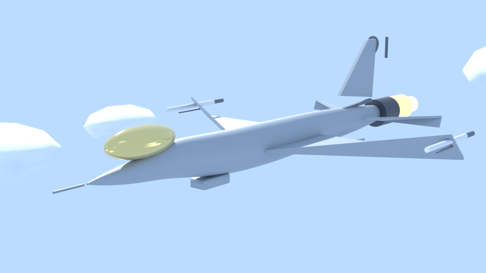
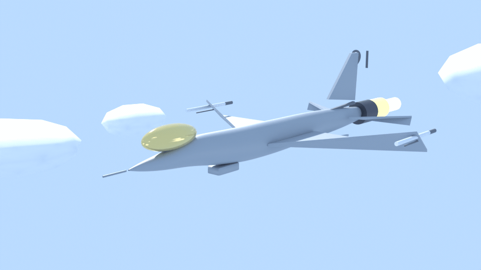
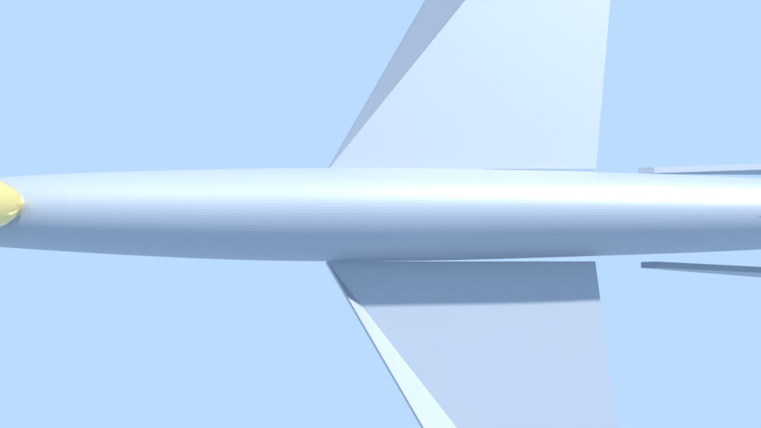
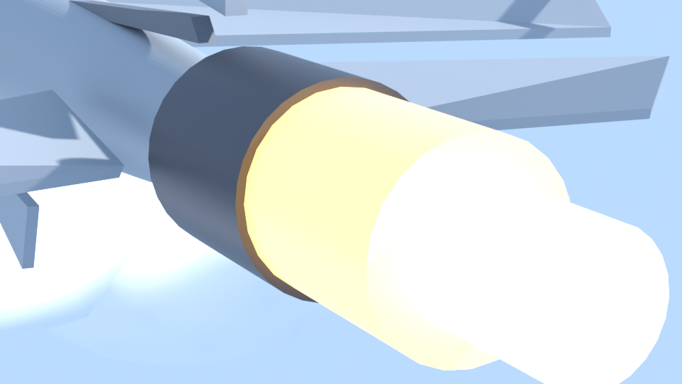
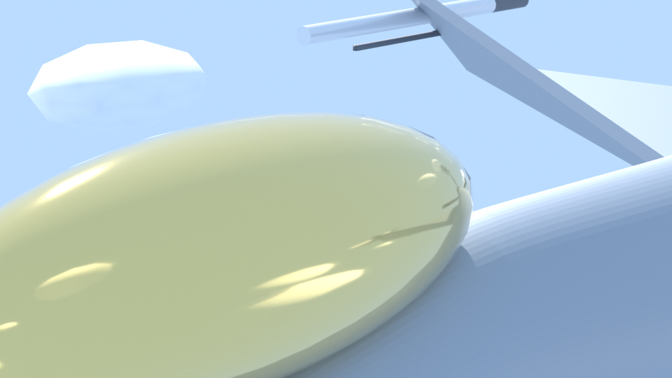

# ⚡ f16-cinema

**EN:** An **F-16C Fighting Falcon** built entirely in code — lofted fuselage from 16 cross-sections, swept wings with wingtip AIM-9s, single tail, ventral fins, gold-tinted canopy — flying through a drifting cloud field with a flickering afterburner, rendered in Cycles and **verified against Lockheed spec dimensions** (length 15.03 m, span 9.96 m).

**TR:** Tamamı kodla inşa edilmiş **F-16C Fighting Falcon**: 16 kesit profilden loft edilmiş gövde, kanat ucu AIM-9 füzeleri, tek dikey kuyruk, ventral finler, altın tonlu kabina — bulutların arasında süzülerek, titreyen art yakıcıyla Cycles'ta render edilir ve **Lockheed spec ölçüleriyle otomatik doğrulanır**.



## 📐 Spec doğrulaması / Spec gate

```text
[ok] uzunluk (burun-nozzle): 14.95 m   (spec 15.03 ± 0.35)
[ok] kanat açıklığı:          9.97 m   (spec  9.96 ± 0.25)
[ok] yükseklik:               3.72 m   (spec  3.60 ± 0.15, uçuş konfigürasyonu)
[ok] AIM-9 fuze sayisi:       4 parça (2 fuze + 2 burun konisi)
```

## 🖼️ Gallery / Galeri

### 🥇 Hero — bulutlarda art yakıcıyla


### 🎞️ Uçuş animasyonu — 36 kare


### 📐 Üstten


### 🔥 Nozzle / Art yakıcı


### 🎯 Kokpit — altın tonlu kabin


## 🧱 Anatomy / Anatomî

| Bölge | Parçalar |
|---|---|
| ✈️ Gövde | 16 kesitli loft gövde (organik yumuşatma + subsurf), çene hava alığı, pitot çubuğu |
| 🪽 Kanatlar | Mid-mounted swept kanatlar (kok→uc taper), kanat ucu AIM-9 rayları + füzeler |
| 🦅 Kuyruk | Tek dikey stabilizatör + koke uzantısı, 2 yatay stabilatör, 2 ventral fin |
| 💎 Kokpit | Altın tonlu kabina (metallic cam), MSB-first koltuk hizası |
| 🔥 Motor | Nozzle + çift katmanlı art yakıcı (iç mavi çekirdek / dış turuncu), kare-başına titreme |
| ☁️ Ortam | 26 sürüklenen bulut kümesi (kare başına kaydırma → hız hissi) |

## ✅ Gates / Kapılar

```bash
blender --background --python f16.py -- --mod spec   # F-16C olcu dogrulamasi
blender --background --python f16.py -- --mod hero   # ucus animasyonu
blender --background --python f16.py -- --mod acilar # 4 aci render
```

Uzunluk, açıklık, yükseklik otomatik ölçülür; sınırdaysa build başarısız sayılır.

## 🧪 Why / Neden

**TR:** f1-cinema karada duran bir arabaydı; bu araç HAVADA. Bulutlar kayar, art yakıcı titrer, kamera süzülür — ve modelin her ölçüsü Lockheed spec'iyle otomatik karşılaştırılır. Loft gövde, quaternion hizalı süspansiyon... bu sefer hepsi havada uçuş configuration'ında.

## 📄 License

MIT
